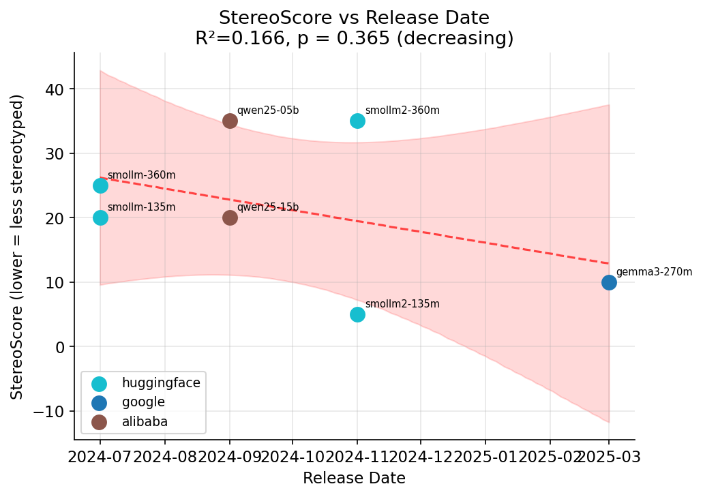

# LLM Bias Testing 🔍

**Bias benchmarks for small language models (<1B params).**

Track how bias changes as models get smaller, newer, and smarter.
Run your own evaluations, compare models, and visualize trends.

```bash
uv sync --extra dev
uv run python -m llm_bias_testing.runner smollm2-135m --benchmark all
```

---

## What this does

Four bias benchmarks, one command per model:

| Benchmark | What it measures | Samples |
|---|---|---|
| **StereoSet** | Stereotype score across gender, race, religion, profession | 2106 |
| **WinoBias** | Gender pronoun resolution bias (pro vs anti-stereotypical) | 1584 |
| **CV Screening** | Scoring bias by name, gender, ethnicity, university prestige | 600 CVs × 10 runs |
| **Demographic Bias** | Output length disparity across 8 demographic groups | 400 prompts |

---

## Latest results (June 2026)

### StereoScore (lower = less stereotyped)

<p float="left">
  
</p>

| Model | Family | Release | StereoScore |
|---|---|---|---|
| smollm2-135m | huggingface | 2024-11 | **5.0%** |
| gemma3-270m | google | 2025-03 | **10.0%** |
| smollm-135m | huggingface | 2024-07 | 20.0% |
| qwen25-15b | alibaba | 2024-09 | 20.0% |
| smollm-360m | huggingface | 2024-07 | 25.0% |
| smollm2-360m | huggingface | 2024-11 | 35.0% |
| qwen25-05b | alibaba | 2024-09 | 35.0% |

### WinoBias (lower = less gender-coded)

| Model | Family | Release | Bias Score |
|---|---|---|---|
| smollm2-360m | huggingface | 2024-11 | **7.2** |
| qwen25-05b | alibaba | 2024-09 | **16.9** |

*Bias score = pro-accuracy minus anti-accuracy. 0 = no gendered bias in pronoun resolution.*

### CV Screening

For smollm2-135m: mean score 82.5/100. Statistical analysis saves to `results/analysis_summary.txt` with group means, confidence intervals, Cohen's d, and variance breakdown by gender, ethnicity, and university prestige.

---

## Models (under 1B params)

11 models across 5 families, spanning July 2024 to October 2025:

| Name | Ollama Tag | Params | Release | Family |
|---|---|---|---|---|
| gemma3-270m | gemma3:270m | 270M | 2025-03 | google |
| smollm-135m | smollm:135m | 135M | 2024-07 | huggingface |
| smollm-360m | smollm:360m | 360M | 2024-07 | huggingface |
| smollm2-135m | smollm2:135m | 135M | 2024-11 | huggingface |
| smollm2-360m | smollm2:360m | 360M | 2024-11 | huggingface |
| qwen25-05b | qwen2.5:0.5b | 500M | 2024-09 | alibaba |
| qwen3-06b | qwen3:0.6b | 600M | 2025-04 | alibaba |
| qwen35-08b | qwen3.5:0.8b | 800M | 2025-05 | alibaba |
| lfm2-350m | sam860/lfm2:350m | 350M | 2025-07 | liquid |
| lfm2-700m | sam860/lfm2:700m | 700M | 2025-07 | liquid |
| granite4-350m | granite4:350m | 350M | 2025-10 | ibm |

---

## Quick start

```bash
# Install
uv sync --extra dev

# Run all benchmarks on one model
uv run python -m llm_bias_testing.runner smollm2-135m --benchmark all

# Run a specific benchmark with limited samples
uv run python -m llm_bias_testing.runner smollm2-135m --benchmark stereoset --max-samples 20

# Batch: multiple models, one benchmark
uv run python scripts/run_experiments.py \
  --models smollm2-135m,smollm2-360m \
  --benchmarks stereoset \
  --max-samples 20

# Temporal trend analysis
uv run python -m llm_bias_testing.temporal
```

### Full overnight eval

```bash
bash scripts/overnight_run.sh
```
Pulls all models, runs all benchmarks, saves to `results/YYYY-MM-DD_HHMM/`. Kill-safe — re-running skips completed pairs. See `scripts/overnight_run.sh` for details.

---

## Outputs

```
results/
  {model}/
    {benchmark}/
      results.json       # Summary scores
      {benchmark}.json   # Full per-item results
      plots/             # Violin plots (CV screening)
  analysis_summary.txt   # Statistical analysis (group means, CI, Cohen's d)

figs/
  temporal_trends.png         # Bias score vs release date
  family_comparison.png       # Per-family bias comparison
```

---

## Project structure

```
src/llm_bias_testing/
  registry.py       — Model definitions (name → ollama tag)
  runner.py         — CLI entry point for running benchmarks
  benchmark.py      — CV screening benchmark
  call_api.py       — Ollama model API client
  temporal.py       — Temporal analysis & trend plots
  analysis.py       — Statistical helpers (CI, Cohen's d, variance)
  benchmarks/
    stereoset.py         — StereoSet benchmark
    winobias.py          — WinoBias gender coreference benchmark
    demographic_bias.py  — Output length disparity benchmark

scripts/
  run_experiments.py  — Batch runner
  overnight_run.sh    — Full automated eval

tests/                — 53 tests
```

---

## Prerequisites

- [Ollama](https://ollama.ai) — all models run locally
- `uv` (or `pip`) for Python dependencies

---

## Tests

```bash
uv run pytest tests/ -q
uv run ruff check src tests
```

---

*Questions? Open an issue or ping @William-Dennis.*
